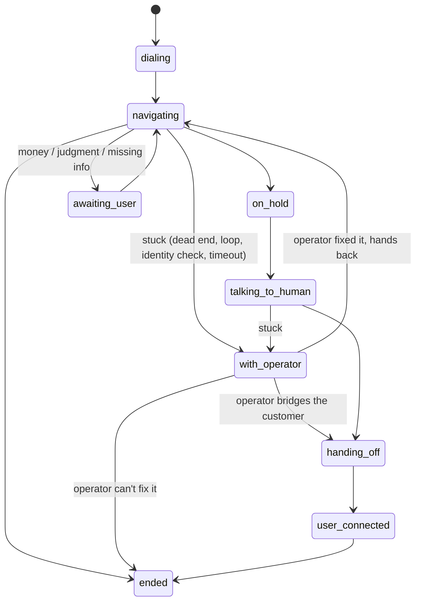

# Design: AI-first, with a human fallback

Voiced resolves most calls with AI. A person steps in only on exceptions, and every exception becomes eval and training data. Pure human operation doesn't scale (cost grows with every customer). Pure AI loses customers on the 10–20% of calls it gets wrong: dead ends in the phone tree, loops, long holds, disputes, identity checks it can't pass.

## Call states



- **Escalation is a first-class state, not an error path.** When the agent is stuck, it hands the call and its full context (redacted transcript, the step, the reason, the facts as placeholders) to the operator queue. A call never just fails silently. Triggers:
  - the brain decides it's stuck (no option leads to the goal, or the tree won't transfer to a person);
  - the session sees the same screen three times (loop detection runs in code, whatever the brain says);
  - the user can't supply information an identity check needs;
  - the call runs past its time budget.
- **Operators act through the same vault and guard as the AI.** They press `{{account}}`, never the digits, and they never see secret values. What they do on an automated screen is learned into the IVR map, so the next call handles that exception without anyone. Without an operator desk configured, a stuck call ends as `failed` with its reason and step recorded.
- **The customer is a separate fallback from the operator.** Only the user can answer "what's your SSN?" or approve a fee, so those go to the user (`awaiting_user`). Operators handle navigation problems.

Code: `src/core/session.ts` (states, loop detection, escalation, outcomes), `src/core/operators.ts` (queue + control), `src/sim/operator.ts` (scripted stand-in).

## Outcome record (every call)

```ts
resolution: 'ai' | 'human_assisted' | 'failed'
result?:  { kind: 'bill_paid' | 'membership_canceled' | 'reservation_booked' | 'human_reached',
            confirmation, amount, evidence: { t, text } }   // the billable, auditable result
failure?: { reason, detail, step, t }                       // also kept when an operator rescued the call
escalations, operatorTouches, userTouches, mapHits, llmCalls, callMs, holdMs
```

Failure reasons: `dead_end`, `loop`, `identity_check`, `business_unavailable`, `hung_up`, `user_declined`, `timeout`, `unresolved`.

- **Top-line metric:** share of calls resolved by AI with no human (`GET /v1/stats` → `ai_resolution_rate`). Completion rate (AI + human-assisted) sits beside it, with `exceptions_by_reason` for the work queue.
- **Pricing per result:** `result.kind` + `confirmation` + `evidence` (the exact line on the call, with its timestamp) is what gets billed. A call without a result costs the customer nothing.
- A user approving a fee or typing an SSN doesn't count as human help: that's authorization. Only operator actions make a call `human_assisted`.

## Eval harness

The simulator doubles as the eval. `npm run eval` replays every tree twice (cold map, then warm) and scores each call's outcome against what a correct agent should do:

| Case | What it tests | Expected |
|---|---|---|
| `bedford`, `irontemple`, `kestrel`, `luna` | Bill pay, cancellation with retention offers, deflection + hold + handoff, speech booking | AI |
| `irontemple-loop` | A menu option that loops back; the working path isn't announced | Human-assisted first, **then AI** (map learned the operator's fix) |
| `bedford-verify` | Identity check the task has no answer for | AI (asks the user; answer goes to the vault) |
| `bedford-down` | Payments by phone are offline | Failed, `business_unavailable` |
| `bedford-moved` | Menu reshuffled since the map was learned | AI (replay fails once, map heals) |
| `kestrel-closed` | Queue refuses callers after the menus | Failed, `business_unavailable` |

Current result (rules brain): 18/18 calls match their expected outcome. Resolved by AI 72%, with human help 6%, failed 22% (every failure is a closure no one could finish by phone). Recorded real calls become new cases by adding a scenario with its `expect` block.

## Voice stack: bought, behind an interface

Telephony, speech-to-text, TTS and the model are commodities. `Line` (`src/core/types.ts`) is the whole telephony contract: `dial`, `next`, `sendDigits`, `say`, `bridge`, `setRecording`, `hangup`. Twilio ConversationRelay implements it today (`src/telephony/twilio.ts`) and the simulator implements it for evals; swapping providers means writing one adapter. The model sits behind `Brain`: rules, Gemini (`src/brains/gemini.ts`) and Claude (`src/brains/claude.ts`) share one prompt and one tool list, and rules take any turn a model fails or is rate-limited on. The moat is the phone-tree map, the workflow knowledge (task facts, policies, playbooks), and reliability.

## Compliance guardrails

- **Vault / PCI.** Card numbers, bank details, account numbers, PINs and SSNs never reach the model prompt, transcripts, logs, operator tickets or API responses. Tones are sent straight from the vault, heard text is scrubbed, and CVVs are wiped at hangup. Recording pauses for every vault entry (`setRecording(false)`; on Twilio, the Recordings API with `Twilio.CURRENT`, not yet verified on a live account). Tests assert no secret appears in any event, ticket or model context.
- **Recording consent.** Real calls aren't recorded unless `VOICED_RECORD=1`. When recording, treat every call as all-party consent (CA, FL, IL, MD, MA, PA, WA and others): the disclosure to any person includes that the call is recorded. The IVR map is built only from automated prompts, never from human speech, and processing stops when the customer is bridged in.
- **Disclosure.** The agent tells every person it speaks to that it's an automated assistant calling on the customer's behalf. Operators are disclosed the same way ("AI with human backup").
- **TCPA line.** Voiced calls businesses for users, never consumers. Real calls go only to allowlisted business lines, or ones the caller explicitly attests are business service lines; the user's own number is dialed only to hand off a call they asked for. Enforced in `CallManager.checkDialPolicy` and tested.
- **Honest about the humans.** Every call reports `resolution`, the stats separate AI from human-assisted, and the demo labels its operator as simulated. The SEC settled with Presto Automation in January 2025 after it marketed a drive-thru AI that needed human intervention on over 70% of orders ([SEC](https://www.sec.gov/enforcement-litigation/administrative-proceedings/33-11352-s)). Voiced's line is "AI with human backup", and the numbers back it.

## Open questions (not blocking)

- **Which side of the call.** The build is consumers (via agents) calling businesses. It's the harder business: consumers pay less, and there are more phone trees and more AIs on the other end. The enterprise Agent Gateway is the path to the other side later.
- **Narrow wedge.** Recommendation: utility bill pay first (one category, frequent, authenticated, structured trees, and the founder's own pain), then cancellations. Reservations and reach-a-human stay in the demo but out of the launch scope.
